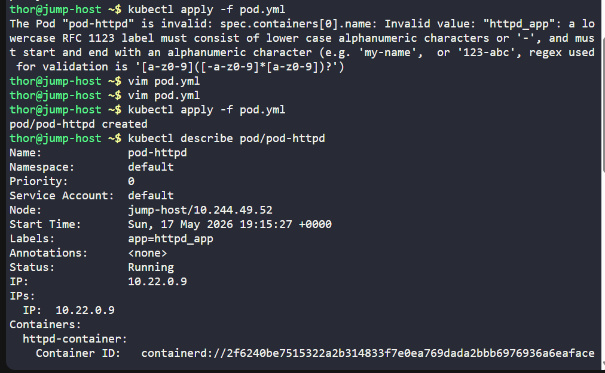
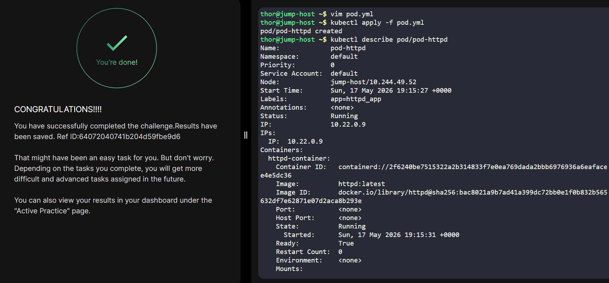

# Day 01 :shipit:

## Task
The Nautilus DevOps team is diving into Kubernetes for application management. One team member has a task to create a pod according to the details below:


Create a pod named pod-httpd using the httpd image with the latest tag. Ensure to specify the tag as httpd:latest.

Set the app label to httpd_app, and name the container as httpd-container.

Note: The kubectl utility on the jump-host has been configured to work with the Kubernetes cluster.
## Commands Used


```

kubectl run pod-httpd --image=httpd:latest --labels=app=httpd_app --dry-run=client -o yaml > pod.yml

kubectl apply -f pod.yml 

kubectl describe pod/pod-httpd 


thor@jump-host ~$ cat pod.yml 
apiVersion: v1
kind: Pod
metadata:
  labels:
    app: httpd_app
  name: pod-httpd
spec:
  containers:
  - image: httpd:latest
    name: httpd-container
    resources: {}
  dnsPolicy: ClusterFirst
  restartPolicy: Always
status: {}

```



## What I Learned

## Notes
