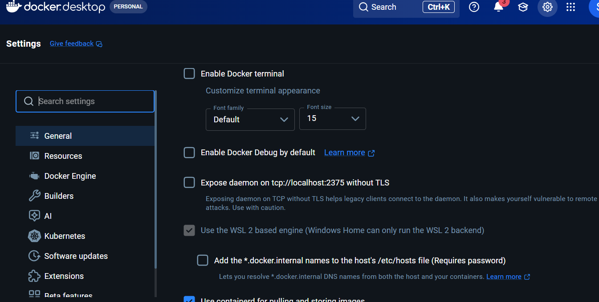
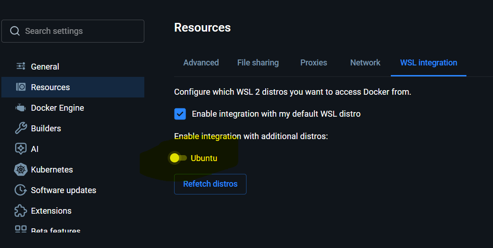
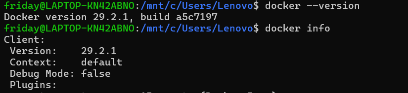
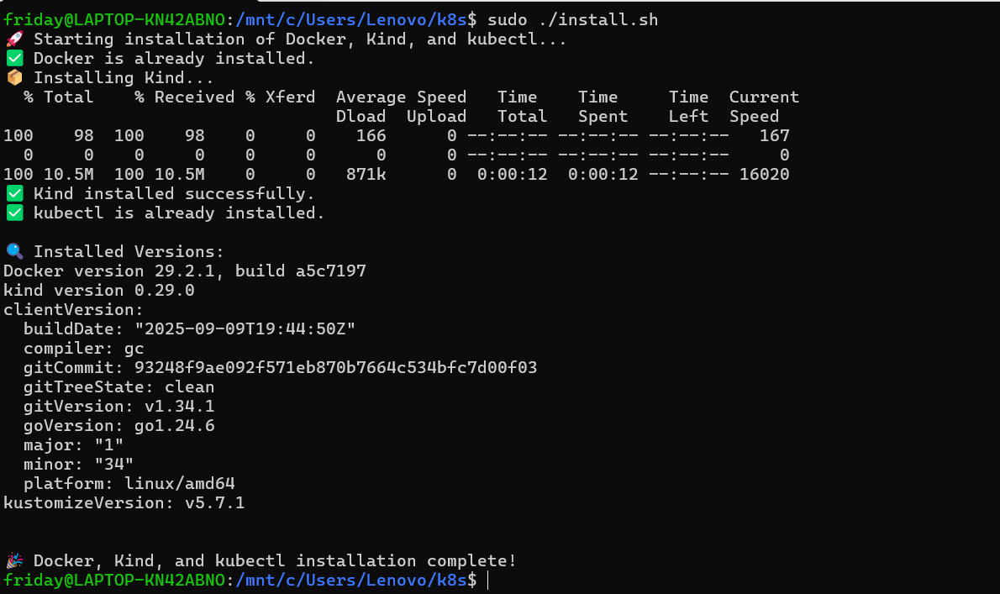

# KIND on windows Installation Guide

kind runs Kubernetes nodes as Docker containers, so the required stack is:

Requirements: 5

- WSL2 + Ubuntu 

- Docker Desktop on Windows

- WSL integration enabled for Ubuntu in Docker Desktop

- kubectl inside Ubuntu

- kind inside Ubuntu

---

## STEP 1 Install WSL + ubuntu
For your laptop, begin with WSL only, not Docker/kind yet.

Do this first in Command Prompt as Administrator:

```
wsl --install
```
- Once installation is completed
- It will ask to create the user and password do the same(It like defining root user)

- Update the machine it may ask you to enter the password you had created
```
sudo apt-get update
```
- Install basic tools like vim, curl.

---

## STEP 2 Docker Install and setup
Now we have to install the Docker Desktop

Download it from the web [Docker Download LINK ](https://docs.docker.com/desktop/setup/install/windows-install/)

After it opens:

   - Go to Settings → General

   - Make sure Use the WSL 2 based engine is enabled

     

   - Go to Settings → Resources → WSL Integration
  
   - enable integration for your Ubuntu distro

     

   - Docker documents both the WSL 2 backend and distro integration flow.
     Verfiy it using commands
     ```
     docker --version
     docker info
     ```
     

---

## Step 3: Install reset of thing via shell script 

- create a file install.sh copy the code in the file.
- Make it executable
- Run it with the sudo permission

- Expected Output: 
  
